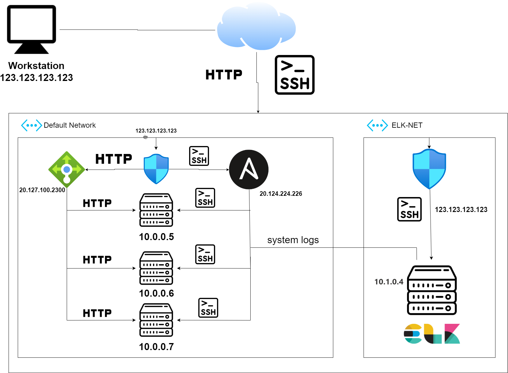
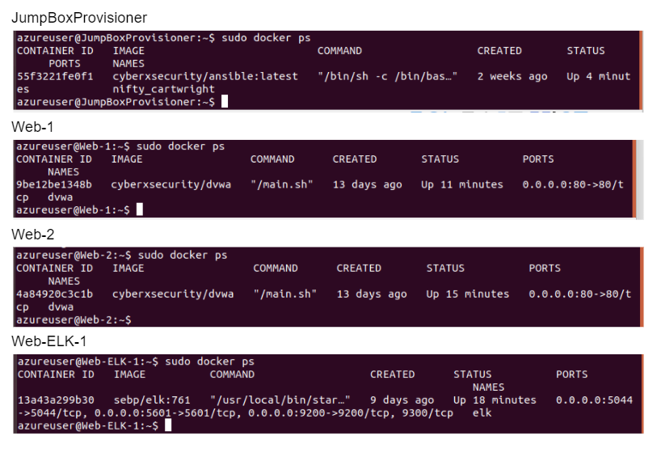

# ELK Stack Project

## Automated ELK Stack Deployment

The files in this repository were used to configure the network depicted below.



These files have been tested and used to generate a live ELK deployment on Azure. They can be used to either recreate the entire deployment pictured above. Alternatively, select portions of the filebeatConf.yml file may be used to install only certain pieces of it, such as Filebeat.

  [ansible docker configuration for web servers](ansible/dockerConf.yml)

  [ansible elk configuration](ansible/elkConf.yml)

  [ansible filebeat configuration](ansible/filebeatConf.yml)

  [ansible web metricbeat configuration](ansible/metricbeatConf.yml)

This document contains the following details:
- Description of the Topologu
- Access Policies
- ELK Configuration
  - Beats in Use
  - Machines Being Monitored
- How to Use the Ansible Build


### Description of the Topology

The main purpose of this network is to expose a load-balanced and monitored instance of DVWA, the D*mn Vulnerable Web Application.

Load balancing ensures that the application will be highly redundant, in addition to restricting incoming traffic to the network.
- _Load balancer makes sure if one server goes down, there are two more servers up and ready to take the traffic. 
- _Jump box allows to have access to all machines within a single machine, write scripts, run them in a single machine and effect every machine_

Integrating an ELK server allows users to easily monitor the vulnerable VMs for changes inside our VMs and system logs.
- _fileabeat helps generate and organize log files to send to LOgstash and Elasticsearch. Information about file system and which files have changed and when_
- _Metricbeat takes the metrics and statistics that it collects, sends them off to the Elasticsearch and Logstash_

The configuration details of each machine may be found below.
_Note: Use the [Markdown Table Generator](http://www.tablesgenerator.com/markdown_tables) to add/remove values from the table_.

| Name     | Function | IP Address | Operating System |
|----------|----------|------------|------------------|
| Jump Box | Gateway  | 10.0.0.4   | Linux            |
| Web 1    | Server   | 10.0.0.5   | Linux            |
| Web 2    | Server   | 10.0.0.6   | Linux            |
| Web 3    | Server   | 10.0.0.7   | Linux            |

### Access Policies

The machines on the internal network are not exposed to the public Internet. 

Only the JumpBoxProvisioner machine can accept connections from the Internet. Access to this machine is only allowed from the following IP addresses:
- _123.123.123.123 which is shown on the diagram as workstation and can be changed to desired location_

Machines within the network can only be accessed by machine within the network.
- _ansible configured machine only has access to elk server which comes from 10.0.0.4 ip address_

A summary of the access policies in place can be found in the table below.

| Name             | Publicly Accessible | Allowed IP Addresses |
|------------------|---------------------|----------------------|
| Jump Box         |        Yes          |  123.123.123.123     |
| Web 1            |        No           |  10.0.0.4            |
| Web 2            |        No           |  10.0.0.4            |
| Web 3            |        No           |  10.0.0.4            |
| Load Balancer    |        No           |  123.123.123.123     |

### Elk Configuration

Ansible was used to automate configuration of the ELK machine. No configuration was performed manually, which is advantageous because...
- _It reduces a lot of manual work going to every single machine and adjusting configurations_

The playbook implements the following tasks:
```
- name: Configure Elk VM with Docker
  	  hosts: elk
  	  remote_user: sysadmin
 	  become: true
  	  tasks:
```

- _Increase system memory:_
```
- name: Use more memory
      	  sysctl:
       	  name: vm.max_map_count
          value: "262144"
          state: present
          reload: yes
```

- _Install the following packages:_
	- _Docker.io_
	- _Python3-pip_
	- _Docker elk container_

- _Launch docker container with these ports:_
	- _5601:5601_
	- _9200:9200_
	- _5044:5044_


The following screenshot displays the result of running `docker ps` after successfully configuring the ELK instance.



### Target Machines & Beats
This ELK server is configured to monitor the following machines:
- _10.0.0.5_
- _10.0.0.6_
- _10.0.0.7_

We have installed the following Beats on these machines:
- _10.0.0.5_
- _10.0.0.6_
- _10.0.0.7_

These Beats allow us to collect the following information from each machine:
- Filebeat is a lightweight shipper for forwarding and centralizing log data. Installed as an agent on your servers, Filebeat monitors the log files or locations that you specify, collects log events, and forwards them either to Elasticsearch or Logstash for indexing.

Metricbeat is a lightweight shipper that you can install on your servers to periodically collect metrics from the operating system and from services running on the server. Metricbeat takes the metrics and statistics that it collects and ships them to the output that you specify, such as Elasticsearch or Logstash_

### Using the Playbook
In order to use the playbook, you will need to have an Ansible control node already configured. Assuming you have such a control node provisioned: 

SSH into the control node and follow the steps below:
- Copy the ansible files to /etc/ansible.
- Update the hosts file to include private ip addresses of the machines you've created
- Run the playbook, and navigate to your machines to check that the installation worked as expected.

- dockerConf.yml should be ran first to configure web servers_
- host file should be modified in in order to hit the right machines. Specify elk machine seperately inside host file in order to configure it_
- 137.135.15.200 (public address for kibana in elk server) port 5601 in order to check if kibana is up and running


